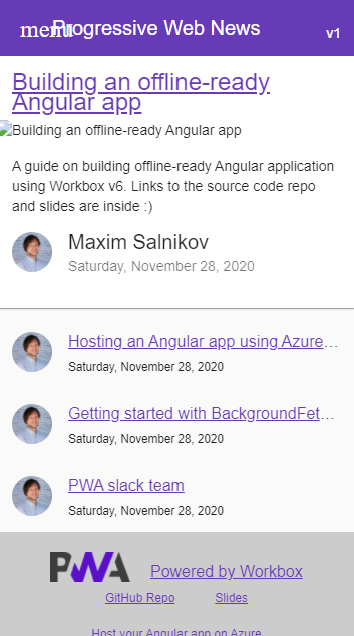

### Workshop contents

- [Intro and Setting up the environment](README.md)
- [What are Progressive Web Apps (PWA). The service worker API is the backbone of PWA functionality.](theory.md)
- [Step 0 - Classic web application](practice-step0.md)
- [Step 1 - App shell with a handmade service worker](practice-step1.md)
- [Step 2 - App shell with Workbox](practice-step2.md)
- **Step 3 - Runtime caching with Workbox**
- [Step 4 - Caching missing pieces with the Workbox recipes](practice-step4.md)
- [Step 5 - Improving app update flow](practice-step5.md)
- [Step 6 - Replaying requests made offline](practice-step6.md)
- [Step 7 - Making app installable](practice-step7.md)
- [Review of other APIs to build a native-like app](other-apis.md)

# Step 3 - Runtime caching with Workbox

We now have all build infrastructure for Workbox ready so the next steps will require focus only on the service worker itself. Let's add caching of the content (blog posts) our application consumes from its API. This kind of resources is fundamentally different from the ones building application shell:
1) We don't think about this data as about something that forms the application itself - it doesn't take part in app versioning
2) Generally, we can't precache this data because we don't know what might be interesting for this particular user on their particular device. Precaching everything is not a good idea (in many cases it's just impossible).
3) In many cases, this kind of data is changing often (imagine list of today's news on the website) so "cache first" strategy is not enough

Still, we can use the power of Service Worker API and great developer experience of Workbox for smart caching of such resources. Both for offline-ready scenarios and immediate loading (when relevant) from the local cache to improve loading speed in online mode.

Before jumping into the code, let's think about what kind of the strategies might be the best fits for particular pieces of data loaded from API by our blog application. To simplify, let's assume we only have four kinds of the blog data:
- Blog post list. It might be quite a dynamic data: we don't want to let our user to miss the recent post just because the JSON with the list items was loaded from the cache (where it was placed during the previous visit). So we want "network first" strategy for the post lists. If the network is not available, we'll try our luck with cache.
- Blog post details. Ones created and posted, this kind of data is normally not updated later. So for this case, to delight our users by the immediate loading of the previously visited blog posts, we can go for the "cache first" strategy. But with Workbox, we can even use its more advanced version calles "stale while revalidate". It will load the resource from cache (if it's there) and at the same time will try to download its updated version from the network. And if there is an update, Workbox will replace the version in cache so the next time the updated content will be served. Also, we'll limit the cache validity period by 7 days using `ExpirationPlugin`. When using this plugin, you have to define a custom cache name using `cacheName` property.
- Avatars from the 3rd-party service Gravatar. The most conservative data: the image with particular address always remains the same so we can safely choose "cache first" strategy to improve performance and save user's bandwidth. Another techinical detail: the responses Workbox receives from the Gravatar are _opaque_, they have response status equal to zero. To be able to cache them, we have to provide zero as a valid status for caching using `CacheableResponsePlugin`. Also, we'll use an alternative notation for specifying the route pattern.
- Blog post images. Quite similar to avatars - "cache first", but let's add extra condition: we'll cache maximum 10 images to not overuse the device's cache.

Using Workbox, we can apply one of the predefined (and implemented) strategies to particular url pattern using built-in router via `registerRoute()` method.

### Adding runtime caching to the service worker

1) Add to `service-worker.js`:

```javascript
import {
  CacheFirst,
  NetworkFirst,
  StaleWhileRevalidate,
} from "workbox-strategies";
import { ExpirationPlugin } from "workbox-expiration";
import { CacheableResponsePlugin } from "workbox-cacheable-response";

// RUNTIME CACHING

// Load details immediately and check for update right after
registerRoute(
  new RegExp("https://progwebnews-app.azurewebsites.net.*content/posts/slug.*"),
  new StaleWhileRevalidate({
    cacheName: "wb6-post",
    plugins: [
      new ExpirationPlugin({
        // Only cache requests for a week
        maxAgeSeconds: 7 * 24 * 60 * 60,
      }),
    ],
  })
);

// Keeping lists always fresh
registerRoute(
  new RegExp("https://progwebnews-app.azurewebsites.net.*content/posts.*"),
  new NetworkFirst()
);

// Avatars can live in cache
registerRoute(
  ({ url }) => url.hostname.includes("gravatar.com"),
  new CacheFirst({
    plugins: [
      new CacheableResponsePlugin({
        statuses: [0, 200],
      }),
    ],
  })
);
```

2) Rebuild service worker

3) Open http://localhost:5000/ in online mode, visit "All posts", visit particular posts.

4) Switch to offline to make sure you see the data on the pages you visited while was online. Everything except blog images and font icons:



We'll fix this on the next step.


## Resources and references

- https://developers.google.com/web/tools/workbox/modules/workbox-routing
- https://developers.google.com/web/tools/workbox/modules/workbox-strategies
- https://developers.google.com/web/tools/workbox/modules/workbox-cacheable-response
- https://developers.google.com/web/tools/workbox/modules/workbox-expiration

## If something went wrong
```
git checkout wb-step3
```

## Next step
[Step 4 - Caching missing pieces with the Workbox recipes](practice-step4.md)
