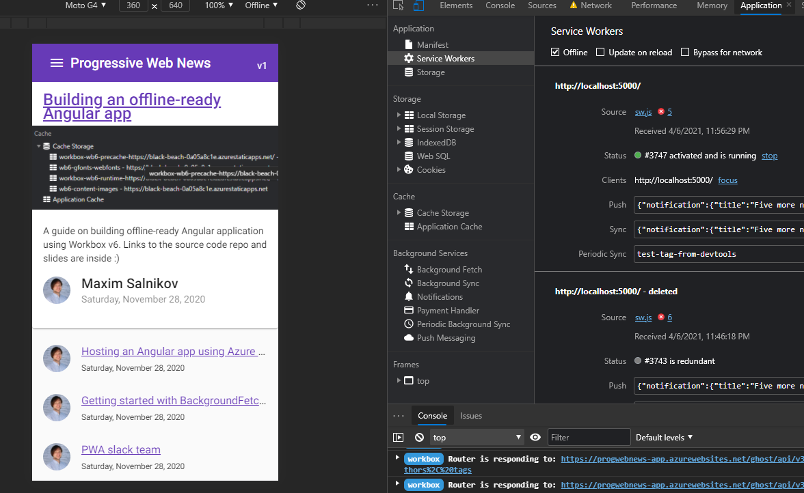

### Workshop contents

- [Intro and Setting up the environment](README.md)
- [What are Progressive Web Apps (PWA). The service worker API is the backbone of PWA functionality.](theory.md)
- [Step 0 - Classic web application](practice-step0.md)
- [Step 1 - App shell with a handmade service worker](practice-step1.md)
- [Step 2 - App shell with Workbox](practice-step2.md)
- [Step 3 - Runtime caching with Workbox](practice-step3.md)
- **Step 4 - Caching missing pieces with the Workbox recipes**
- [Step 5 - Improving app update flow](practice-step5.md)
- [Step 6 - Replaying requests made offline](practice-step6.md)
- [Step 7 - Making app installable](practice-step7.md)
- [Review of other APIs to build a native-like app](other-apis.md)

# Step 4 - Caching missing pieces with the Workbox recipes

In this step, we'll fix a proper offline experience for some parts of our application: fonts (including webfonts responsible for the icons) and blog post images.

❗ It's not the best practice to download fonts from the 3rd-party CDN (compared to self-hosting when you have a chance to inject these resources into the application shell). Anyway, it's a good idea to demonstrate how it might work.

Both for the fonts and images, we can set up a combination of the url pattern and strategy using Workbox routing. These rules might be quite cumbersome, especially for Google Fonts, when you have to process both stylesheet and font files themselves. Workbox offers predefined _recipes_ for these and some other scenarios. The recipes are nothing but higher abstraction methods implemented using Workbox features we went through in the previous steps.

We can use the recipes as is or configure them by providing some parameters like `maxEntries`, `cachePrefix`, etc.

1) Add to `service-worker.js`:

```javascript
import { googleFontsCache, imageCache } from "workbox-recipes";

// STATIC RESOURCES

googleFontsCache({ cachePrefix: "wb6-gfonts" });

// CONTENT

imageCache({ cacheName: "wb6-content-images", maxEntries: 10 });
```

2) Rebuild service worker

3) Open <http://localhost:5000/> in online mode, visit some pages.

4) Switch to offline to make sure that the website is fully functional.


## Resources and references

- <https://developers.google.com/web/tools/workbox/modules/workbox-recipes>

## If something went wrong

```console
git checkout wb-step4
```

## Next step

[Step 5 - Improving app update flow](practice-step5.md)
