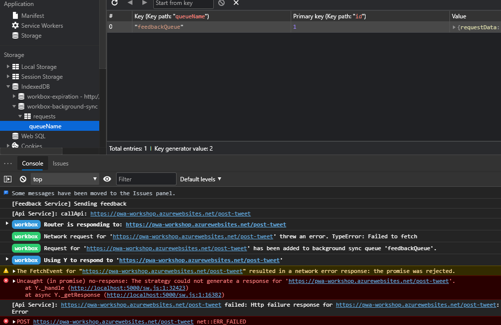
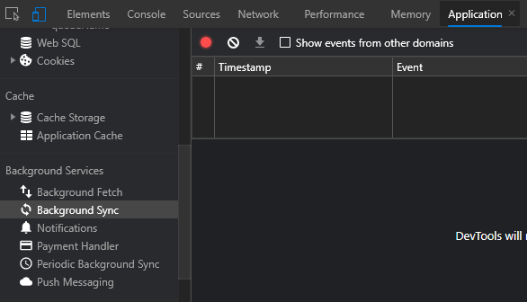

### Workshop contents

- [Intro and Setting up the environment](README.md)
- [What are Progressive Web Apps (PWA). The service worker API is the backbone of PWA functionality.](theory.md)
- [Step 0 - Classic web application](practice-step0.md)
- [Step 1 - App shell with a handmade service worker](practice-step1.md)
- [Step 2 - App shell with Workbox](practice-step2.md)
- [Step 3 - Runtime caching with Workbox](practice-step3.md)
- [Step 4 - Caching missing pieces with the Workbox recipes](practice-step4.md)
- [Step 5 - Improving app update flow](practice-step5.md)
- **Step 6 - Replaying requests made offline**
- [Step 7 - Making app installable](practice-step7.md)
- [Review of other APIs to build a native-like app](other-apis.md)

# Step 6 - Replaying requests made offline

If you write an email, instant message, or simply favourite a tweet, the application needs to communicate that data to the server. If that fails, either due to user connectivity, service availability or anything in-between, the app can store that action in some kind of 'outbox' for retry later.

Unfortunately, on the web, that outbox can only be processed while the site is displayed in a browsing context. This is particularly problematic on mobile, where browsing contexts are frequently shut down to free memory.

Native application platforms provide job scheduling APIs that enable developers to collaborate with the system to ensure low power usage and background-driven processing. The web platform needs capabilities like this too.

A Background Sync API extends Service Workers with a sync event and an API for signalling the desire for this event to fire.

Workbox allows to automate this complex task and to make it as simple as specifying the route you want to retry the network requests to. We'll specify a `NetworkFirst` strategy for the requests done using `POST` method against the API route `/post-tweet` _(this is a legacy name for the route, in this workshop we'll use a feedback form instead of sending tweets)_, and extend this strategy by `BackgroundSyncPlugin` which will repeat the failed requests (if any) using Background Sync API.


1) Add to `service-worker.js`:

```javascript
import { BackgroundSyncPlugin } from "workbox-background-sync";

// BACKGROUND SYNC

// Instantiating and configuring plugin
const bgSyncPlugin = new BackgroundSyncPlugin("feedbackQueue", {
  maxRetentionTime: 24 * 60, // Retry for max of 24 Hours (specified in minutes)
});

// Registering a route for retries
registerRoute(
  // Alternative notation: ({url}) => url.pathname.startsWith('/post-tweet'),
  /(http[s]?:\/\/)?([^\/\s]+\/)post-tweet/,
  new NetworkFirst({
    plugins: [bgSyncPlugin],
  }),
  "POST"
);
```

2) Rebuild service worker

### How to test this feature

1) Navigate to http://localhost:5000/feedback/
2) Test the feedback form by submitting something - you will see the confirmation popup about the message was sent
3) Switch to offline mode and send something using the same form. You will see some errors in the console (this is normal) and some data added to the IndexedDB storage:

4) Switch back to online and you will see that Workbox will replay this request immediately (you can also check it in the Network tab):


The core difference of Background Sync API from all other methods to detect offline/online state and perform some actions based on that is its possibility to perform this sync even after the application tab was closed or even the visible part of the browser was closed - this is why it's the part of Service Worker API family.

There is a separate sections in the Application tab of the Dev Tools dedicated to Background Sync and other Background Services. Let's test it out.

1) Navigate to http://localhost:5000/feedback/
2) Hit the Record (red circle) button of the Background Sync section in Dev Tools

3) Switch to offline mode and send something using the feedback form, switch back to online. You will see the events of your sync:


## Resources and references

- https://developers.google.com/web/tools/workbox/modules/workbox-background-sync
- https://developers.google.com/web/updates/2015/12/background-sync

## If something went wrong
```
git checkout wb-step6
```

## Next step
[Step 7 - Making app installable](practice-step7.md)
